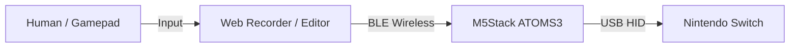

# Switch Macro Recorder & Player

PCブラウザでコントローラー操作を記録・編集し、**Bluetooth (BLE) でワイヤレス転送**。
**M5Stack ATOMS3** が Nintendo Switch のコントローラーとして振る舞い、マクロを正確に自動再生します。



## ✨ 特徴 (Features)

*   **完全ワイヤレス転送**: マクロデータの更新に USB ケーブルの繋ぎ直しは不要です。Switch に挿したまま、PC/スマホから BLE で新しいマクロを即座に書き込めます。
*   **スタンドアロン再生**: マクロデータは ATOMS3 内部のストレージ (LittleFS) に保存されます。一度転送すれば、PC を閉じた状態でも、本体ボタンを押すだけでいつでもマクロを再生可能です。
*   **高精度な入力再現**:
    *   **同時押し完全対応**: A+B, L+R などの同時押しも正確に再現（独自実装の HID レポート処理により、純正プロコン同等の挙動を実現）。
    *   **アナログスティック対応**: 繊細なスティック操作も記録・再生できます。
*   **Web ベースのエディタ**: インストール不要のブラウザアプリで、タイムライン編集やプレビューが可能です。
*   **テキスト編集**: マクロデータは汎用的な JSON 形式です。ダウンロードしてテキストエディタで開き、数値を直接書き換えるような緻密な編集も可能です。

## 🛠️ プロジェクト構成

- `recorder/`: 簡易レコーダー (Gamepad API 使用)
- `editor/`: 高機能エディタ & BLE 転送ツール (React + Vite)
- `esp/`: ファームウェア (ESP32-S3 / Arduino)
- `schema/`: JSON データ構造定義

## 🚀 セットアップ手順

### 1. ハードウェアの準備
*   **M5Stack ATOMS3** / **ATOMS3 Lite**: 本体 (Liteにて動作確認済み)
*   **USB-C ケーブル**: Switch ドック接続用（データ通信対応のもの）

### 1. ソフトウェアの準備
*   **Arduino IDE**: ファームウェア書き込み用
*   **Node.js** (v18以降推奨): Web エディタのビルド用

### 2. ファームウェアの書き込み
1.  **Arduino IDE** を起動します。
2.  **ボードマネージャ** で `M5Stack` を追加し、`M5Stack ATOMS3` を選択します。
3.  **ライブラリマネージャ** から以下をインストールします：
    *   `M5AtomS3` (by M5Stack)
    *   `NimBLE-Arduino` (by h2zero)
    *   `ArduinoJson` (v6.x or later)
4.  `esp/switch_macro_player/switch_macro_player.ino` を開きます。
5.  ATOMS3 を PC に USB ケーブルで接続します。
    *   **重要**: 2回目以降の書き込み時や、書き込みが失敗する場合は、本体側面の **リセットボタンを長押し (約2秒)** して緑色点灯（ダウンロードモード）にしてから書き込んでください
6.  **ツールメニュー** で以下の設定を確認して書き込みます：
    *   **USB CDC On Boot**: `Disabled`
    *   **USB Mode**: `USB-OTG (TinyUSB)`

### 3. Web エディタの起動 (開発モード)
1.  `editor` ディレクトリへ移動し、依存関係をインストールします。
    ```bash
    cd editor
    npm install
    ```
2.  開発サーバーを起動します。
    ```bash
    npm run dev
    ```
3.  表示された URL (例: `http://localhost:5173`) をブラウザで開きます。

### 4. プロダクションビルド (静的ファイルの生成)
GitHub Pages や S3 等の静的ホスティングにデプロイする場合は、以下のコマンドでビルドします。
```bash
npm run build
```
`editor/dist/` ディレクトリに生成されたファイル一式をサーバーにアップロードしてください。

## 🎮 使い方ガイド

### 1. 接続と準備
1.  **ATOMS3** を Switch ドックの USB ポートに接続します。
    *   Switch が "Pro Controller" として認識します。
    *   **ヒント**: 接続しただけでは反応しない場合があります。その際は**ATOMS3 の画面（Button A）を一回押して**、信号を送出させてください。なお、**初回接続時などでマクロが未転送の場合はボタンを押しても反応しませんが、電源が供給（画面点灯など）されていれば準備OKです**。
2.  PC で Web エディタ (`http://localhost:5173`) を開きます。
3.  PC に USB/Bluetooth コントローラーを接続し、エディタ画面で認識されていることを確認します。
4.  エディタ右上の **「ATOMS3に接続」** をクリックし、ペアリングします。

### 2. ライブ記録 (Live Recording)
**Switchの画面を見ながら、PCに繋いだコントローラーで操作して記録できます。**

1.  エディタの **「記録開始」** ボタンを押します（待機状態になります）。
2.  コントローラーを操作すると、実際の記録が始まります。
3.  同時に、**操作内容がリアルタイムで ATOMS3 に送信され、Switch が動きます**（パススルー機能）。
    *   これにより、ゲーム画面でキャラの動きを確認しながら正確なマクロ作成が可能です。
4.  操作が終わったら **「記録停止」** を押します。

### 3. マクロの編集と転送
1.  記録されたタイムラインが表示されます。不要な待機時間の削除や、ボタンの追加・修正を行います。
2.  **ループ設定**: 必要に応じて、「繰り返し回数」や「ループ間隔 (秒)」を設定します。
    *   **回数**: `0` にすると無限ループになります。
    *   **間隔**: ループの間に待機時間を挟むことができます（周回調整に便利です）。
3.  **「ATOMS3に転送」** ボタンをクリックします。
4.  本体の **画面（またはLED）** が緑色に点灯し、転送が完了するのを待ちます。

### 4. オフライン再生
1.  PC との接続（ブラウザ）を閉じても、マクロは ATOMS3 本体に保存されています。
2.  ATOMS3 正面の **「Button A」** を押すと、マクロ再生が **開始/停止** します。
    *   周回作業などで、PC なしで手軽に利用できます。

## ⚠️ トラブルシューティング

**Q. Switch の「入力動作チェック」画面で同時押しが片方しか光らない**
**A. これは Switch 側の表示仕様である可能性が高いです。**
実際のゲーム画面やホームメニューでは、正しく同時押し（例: L+R でロック解除など）が機能することを確認済みです。動作確認は必ず「実際の操作」で行ってください。

**Q. 転送が途中で止まる**
**A. BLE の接続状況を確認してください。**
PC の Bluetooth アダプタと ATOMS3 の距離を近づけてください。また、ブラウザのリロードや ATOMS3 の再起動（リセットボタン）を試してください。

## 📜 ライセンス

[MIT License](LICENSE)

---

**免責事項**: 本ツールは学習・研究用途および、オフラインでの個人の利便性向上を目的としています。オンラインゲームでの自動化、BOT 行為、規約で禁止されている利用方法には使用しないでください。製作者は本ツールの使用により生じた損害（BAN 等を含む）について一切の責任を負いません。

『Nintendo Switch』に関して
本プロジェクトは Nintendo および 任天堂株式会社 とは一切関係ありません。
